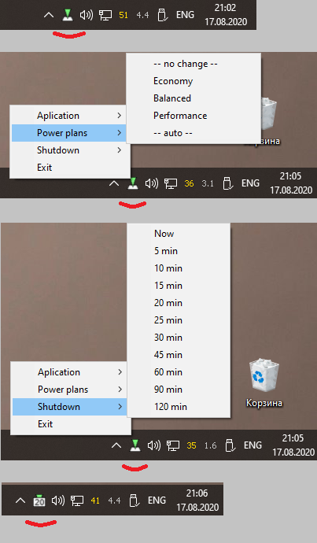
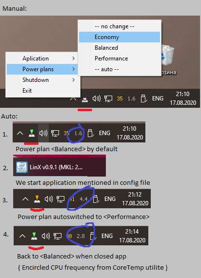

# powerplan
power management for windows (through powercfg shell command) via system tray.

Overview:



This tool allow manually switch existing power plans and AUTO switch power plans by autochecking launched applications.

Main Usage:



#### Requirements:
Python 3
pip install pystray, psutil, winsound
#### Install:

A. List existing power schemas by call:```powercfg -list ``` in cmd shell or Windows PowerShell. Check schema names.

B. Edit _powerplan.cfg_ file. Fill __[Plans]__ section by power schema names: ```short_name_for_find = long_name_for_display_in_menu```.
Fill __[Applications]__ section by: ```application.exe = power_level_index```. Level index is ordered in [Plans].

C. Open cmd shell or  Windows PowerShell. Test execution of script:

	>python.exe "_path_to_powerplan_dir_\powerplan.py"

Be sure u have no errors, just information output. Find new icon on system tray, choose exit.

D. Main call through pythonw:

	>pythonw.exe "_path_to_powerplan_dir_\powerplan.py" -hide

Test autoswitch of schemas by launching and stopping application, specified on [Applications] section.

E. Open windows scheduler, create new task with trigger: logon, and action: start program from previous step.

#### Config example:
powercfg -list:
* GUID схемы питания: 381b4222-f694-41f0-9685-ff5bb260df2e  (Сбалансированная) *
* GUID схемы питания: 8c5e7fda-e8bf-4a96-9a85-a6e23a8c635c  (Высокая производительность)
* GUID схемы питания: a1841308-3541-4fab-bc81-f71556f20b4a  (Экономия энергии)

Translated to [Plans] section:
* Экон = Экономный
* Сбал = Сбалансированный
* Высок = Высок.производительность

(Экон = Economy, Сбал = Balanced, Высок = Performance) in russian

#### Issues:
Config file location is set up in line 18: ```config.read(sys.path[0] + '\powerplan.cfg') #```

Font set up in file 'powerplan_image.py', line 51
